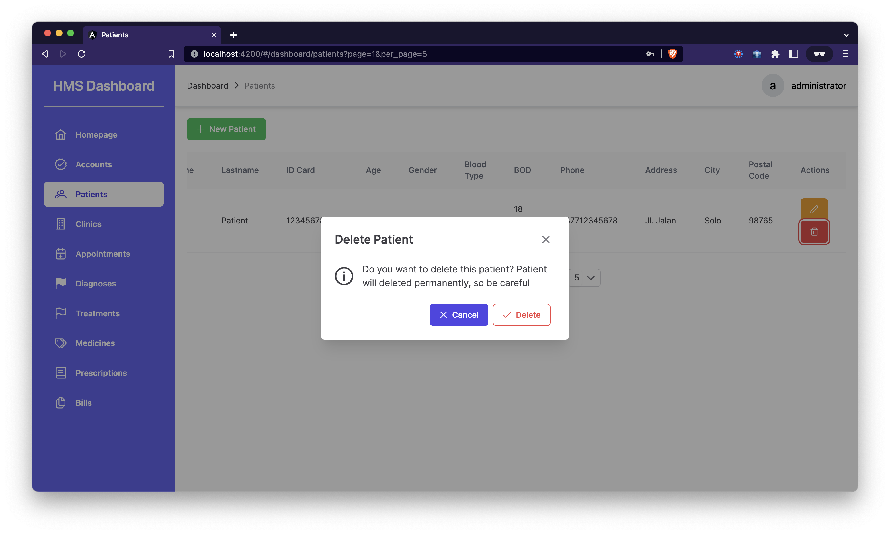

# Hospital Management System

This project was generated with [Angular CLI](https://github.com/angular/angular-cli) version 14.2.3.

## Screenshot Apps

### Login


### Homepage


### Accounts


### Patients




### Clinics


### Appointments


### Diagnoses


### Treatments


### Medicines


### Prescriptions


### Bills


## How To Create New Issue

### Title (with prefix)

1. NFR = New Feature Request
2. NR = Need Review
3. NI = Need Improvement
4. BE = Backend
5. FE = Frontend
6. UI/UX
7. HLA = High Level Architecture
8. BUGFIX
9. HOTFIX

Example:

```bash
[NFR] Signup Page
[BUGFIX] Signup => Submit functionality
[NI] Login => Input text size
```

### Description

Issue description consists of 3 informations:

1. Design Picture (Optional)
2. Description (Description detail of the issue, Required)
3. Branch (Branch name of the issue, Not required if the branch is exist)

Example:

==================================================================

```text
## Design

No design

## Description

Create new login page with login functionality

## Branch

$ git checkout feature/login
```

==================================================================

## How To Naming Branch

There are several types of branch:

1. feature: A new feature
2. bugfix: A fix for issues found through development lifecycle
3. hotfix: A fix on live, active apps, zero to minimal downtime for users
4. coldfix: A fix on live, active apps, visible impact via downtime or system restarts

Example:

```bash
feature/prescription-update
bugfix/signup-submit
hotfix/diagnose-crud
```
